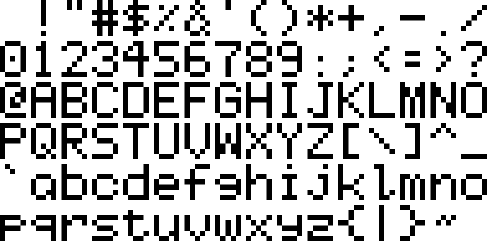
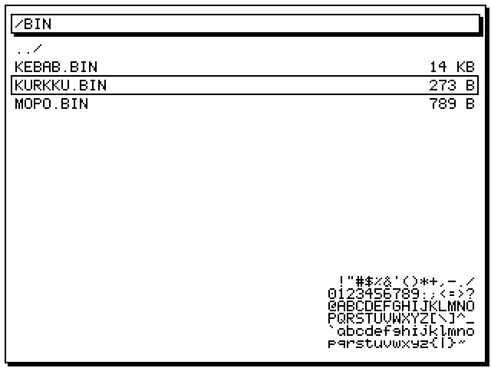

<h1 align="center">MISA</h1>

68k SBC somewhat inspired by the Lisa and the Mac, and similar projects around the net.

MC68HC000P16 (at 4/8/16 MHz)
 
1MB ROM (2x SST39SF040)
 
1MB SRAM (2x AS6C4008-55PCN)
 
ATF1508 CPLD for glue
 
UART
 
CF card
 
Monochrome display
 
Audio with YM2151?
 
Keyboard?
 
Wifi with WizFi360???

### TODO

- [x] Font 
- [ ] HW proto
- [ ] PLD logic
- [ ] UART stuff
- [ ] Display stuff
- [ ] Input stuff
- [ ] FAT16/VFAT 
- [ ] File manager
- [ ] A beep
- [ ] Text editor
- [ ] Terminal emulator
- [ ] Lisp interpreter
- [ ] ?????
- [ ] Multitasking kernel

### Docs

[68000 Hardware Manual](https://bitsavers.org/pdf/peripheralTechnology/68000_Hardware_Manual.pdf)

[M68000 User's Manual](https://www.nxp.com/docs/en/reference-manual/MC68000UM.pdf)

### BOM

| Ref | Part | Qty | Package | Datasheet | Notes |
|---|---|---|---|---|---|
||MC68HC000|1|DIP64/PLCC68|[Datasheet](https://igspgm.com/repairs/MC68HC000.pdf)|MPU|
||YM2151|1|DIP24|[Datasheet](https://retrocdn.net/images/1/1c/YM2151_datasheet.pdf) [Application manual](https://retrocdn.net/images/9/9c/YM2151_Application_Manual.pdf)|Sound|
||YM3012|1|DIP16|[Datasheet](https://datasheet4u.com/pdf-down/Y/M/3/YM3012-Yamaha.pdf)|DAC|
||TDA2822M|1|DIP8|[Datasheet](https://www.mouser.com/catalog/specsheets/stmicroelectronics_cd00000134.pdf)|Power amp|
||AS6C4008-55PCN|2|DIP32|[Datasheet](https://eu.mouser.com/datasheet/3/893/1/AS6C4008.pdf)|SRAM|
||SST39SF040|2|PLCC32|[Datasheet](https://ww1.microchip.com/downloads/aemDocuments/documents/MPD/ProductDocuments/DataSheets/SST39SF010A-SST39SF020A-SST39SF040-Data-Sheet-DS20005022.pdf)|ROM|
||ATF1508AS|1|PLCC84|[Datasheet](https://ww1.microchip.com/downloads/en/DeviceDoc/doc0784.pdf)|CPLD|
||TL16C550|1|PLCC44|[Datasheet](https://static6.arrow.com/aropdfconversion/2dfff6e629d921fe824147bb28d8fe9afac699f1/gm16c550.pdf)|UART|
||NE555P|1|DIP8|[Datasheet](https://www.ti.com/lit/ds/symlink/se555.pdf?HQS=dis-dk-null-digikeymode-dsf-pf-null-wwe&ts=1771745013638&ref_url=https%253A%252F%252Fwww.ti.com%252Fgeneral%252Fdocs%252Fsuppproductinfo.tsp%253FdistId%253D10%2526gotoUrl%253Dhttps%253A%252F%252Fwww.ti.com%252Flit%252Fgpn%252Fse555)||
||SN74HC05N|1|DIP14|[Datasheet](https://www.ti.com/lit/ds/symlink/sn74hc05.pdf?HQS=dis-dk-null-digikeymode-dsf-pf-null-wwe&ts=1771768334330&ref_url=https%253A%252F%252Fwww.ti.com%252Fgeneral%252Fdocs%252Fsuppproductinfo.tsp%253FdistId%253D10%2526gotoUrl%253Dhttps%253A%252F%252Fwww.ti.com%252Flit%252Fgpn%252Fsn74hc05)||
||SN74HCT74N|1|DIP14|[Datasheet](https://www.ti.com/lit/ds/symlink/sn74hct74.pdf?HQS=dis-dk-null-digikeymode-dsf-pf-null-wwe&ts=1771757308194&ref_url=https%253A%252F%252Fwww.ti.com%252Fgeneral%252Fdocs%252Fsuppproductinfo.tsp%253FdistId%253D10%2526gotoUrl%253Dhttps%253A%252F%252Fwww.ti.com%252Flit%252Fgpn%252Fsn74hct74)||
||16 MHz oscillator|1|DIP8|[Datasheet](https://www.ctscorp.com/Files/DataSheets/Passives/FCP/Clock-Oscillators/clock-ocillators-MXO45_MXO45HS-datasheet.pdf)||
||1.8432 MHz oscillator|1|DIP8|[Datasheet](https://www.ctscorp.com/Files/DataSheets/Passives/FCP/Clock-Oscillators/clock-ocillators-MXO45_MXO45HS-datasheet.pdf)||
||WizFi360-CON|1||[Datasheet](https://docs.wiznet.io/pdf-viewer?file=%2Fassets%2Ffiles%2Fwizfi360_ds_v112_en-1495cb0bcb7e6583e492b1b8967f7fb4.pdf)|WIFI|
||5.7" 320240 RA8835|1||[Module](https://www.buydisplay.com/download/manual/ERM320240-1_Series_Datasheet.pdf) [Controller](https://www.buydisplay.com/download/ic/RA8835.pdf)|Display|

### Memory map (RAM vectors + 2 MiB I/O)

| Region   | Start      | End        | Size   | Notes |
|---------|------------|------------|--------|-------|
| ROM     | 0x00000000 | 0x000FFFFF | 1 MiB  | 2x SST39SF040; contains reset vectors, monitor, bootloader; early startup runs from here. |
| Vectors | 0x00100000 | 0x001003FF | 1 KiB  | Vector table copied from ROM into RAM at boot; CPU configured to use RAM vectors.|
| RAM     | 0x00100000 | 0x001FFFFF | 1 MiB  | Same 1 MiB SRAM; low area holds vectors + kernel data, high end used for supervisor/user stacks and heap. |
| I/O     | 0x00E00000 | 0x00FFFFFF | 2 MiB  | CPLD‑decoded I/O window for UART, IDE/CF, keyboard, video, audio, WiFi, unused space.|
| Unused  | Everything else | -     | -      ||

### I/O submap (0x00E00000–0x00FFFFFF)

| Device   | CS        | Start      | End        | Size    | Bus width | Notes |
|---------|-----------|------------|------------|---------|-----------|-------|
| UART    | UART_CS   | 0x00E00000 | 0x00E00FFF | 4 KiB   | 8‑bit     | TL16C550 on D0–D7, A0–A2 from CPU A1–A3.|
| IDE / CF| IDE_CS0/1 | 0x00E01000 | 0x00E01FFF | 4 KiB   | 16‑bit    | 16‑bit data path via CPLD, command/control regs.|
| Keyboard| KBD_CS    | 0x00E02000 | 0x00E02FFF | 4 KiB   | 8‑bit     | Simple DATA/STATUS/CONTROL registers.|
| Video   | VID_CS    | 0x00E03000 | 0x00E03FFF | 4 KiB   | 8‑ or 16‑bit | RA8835 controller regs; framebuffer mapped elsewhere or via paging.|
| Audio FM| AUD_FM_CS | 0x00E04000 | 0x00E04FFF | 4 KiB   | 8‑bit     | YM2151 register interface; DAC/analog path is fixed hardware, no CPU control.|
| WiFi    | WIFI_CS   | 0x00E05000 | 0x00E05FFF | 4 KiB   | 8‑bit     | WizFi360 memory‑mapped UART/command regs (future). |
| Unused  | –         | 0x00E06000 | 0x00FFFFFF | ~1.97 MiB | 8‑ or 16‑bit ||
